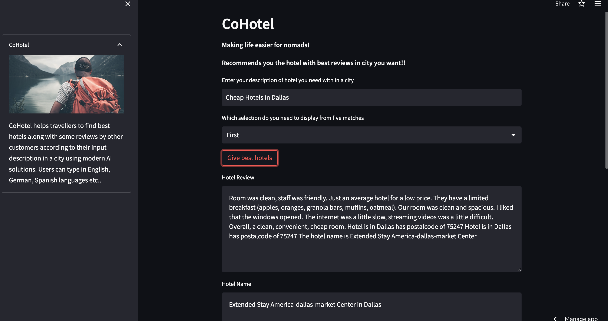

#  CoHotel
Recommend and book the most suitable accommodation for you based on your purpose, mood, and budget.

## About

"It's a match! You are more likely to leave a great review after staying at this accommodation."

Travelers often struggle with bad experiences and miss great ones with the accommodations they choose for their travels. This Accommodation Recommender assists the user in choosing the most convenient accommodation for their stay by detecting their most frequent destinations during their stay, mood, and budget.

## Examples
* "Find the hotel"
* "Which hotel is better"
* "Find a good hotel"
* "Hotels nearby"

## Category
**Information**
Entertainment

## Tags

# CoHotel

# App link 
[CoHotel](https://gowtham07-hotelrecommendation-app-bv57zs.streamlit.app/)